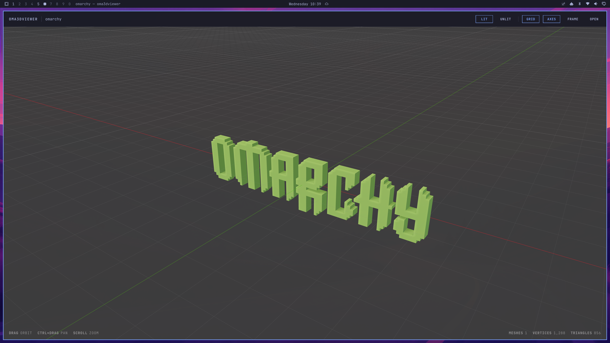
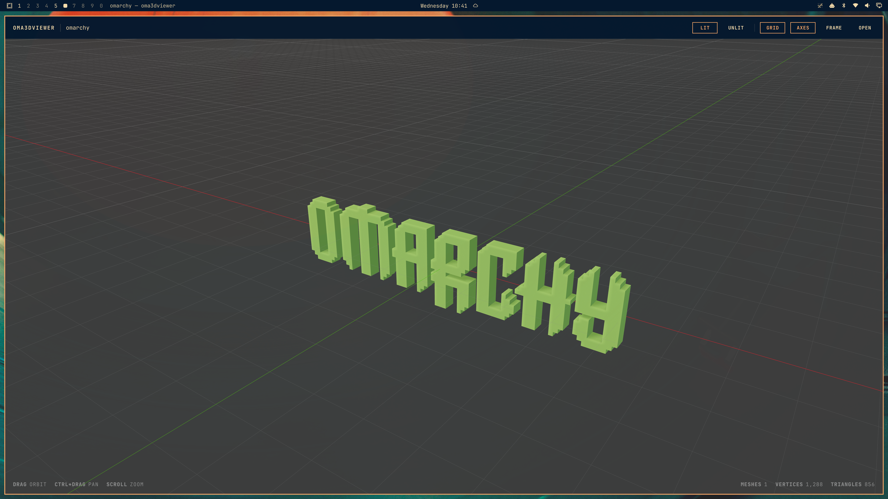
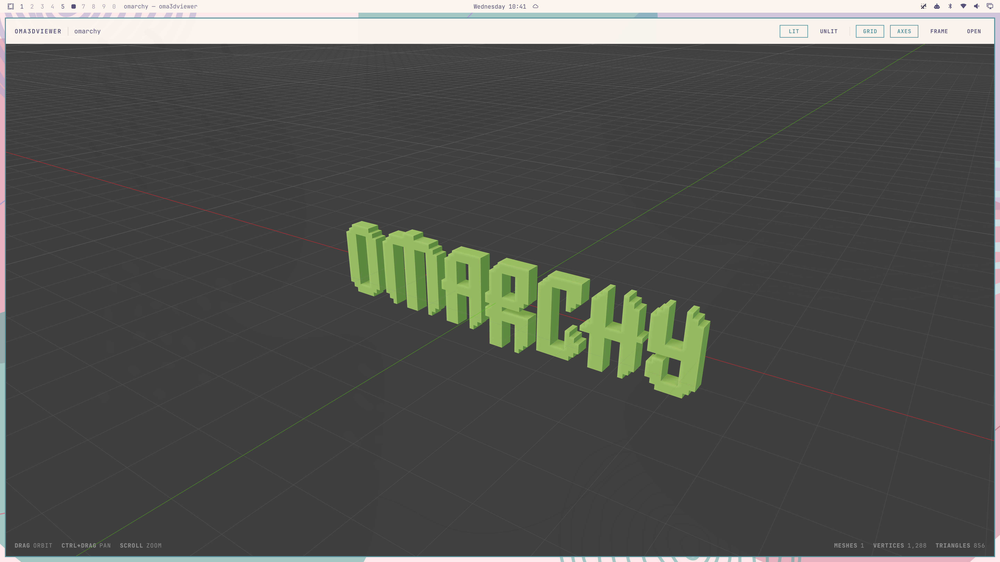

# Oma3DViewer

A 3D model viewer for Omarchy. Oma3DViewer opens GLB, glTF, FBX and OBJ assets,
previews Blender scenes when Blender is installed, and follows the active
Omarchy theme automatically.



## Theme-aware interface

Viewport, controls, borders and grid colors adapt to the current Omarchy
theme, including light and dark variants.

| Dark theme | Light theme |
|:---:|:---:|
|  |  |

## Install on Omarchy

```bash
git clone https://github.com/nicopellerin/oma3dviewer.git
cd oma3dviewer
./bin/install
```
